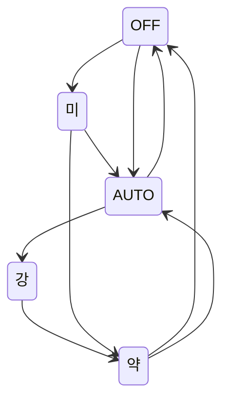
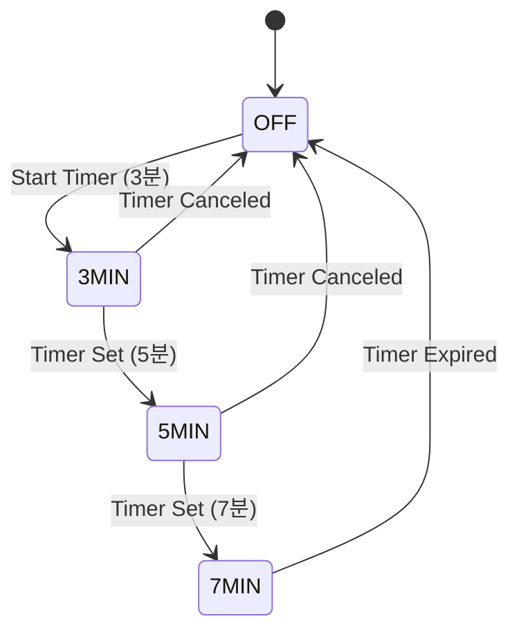

# ATmega128_Smart_Fan

# 🚀 ATmega128_Smart_Fan

ATmega128A를 사용하여 선풍기를 제어하는 임베디드 시스템 프로젝트입니다.  
버튼을 통해 풍량을 제어하고, 타이머를 이용해 자동으로 꺼지도록 설정되어 있습니다.

---

## 📖 목차
- [📌 프로젝트 개요](#📌-프로젝트-개요)
- [🛠️ 개발 환경](#🛠️-개발-환경)
- [⚙️ 시스템 동작 원리](#⚙️-시스템-동작-원리)
- [💻 사용 방법](#💻-사용-방법)
- [🔑 주요 기능](#🔑-주요-기능)

---

## 📌 프로젝트 개요
ATmega128A를 활용한 선풍기 제어 시스템입니다.

## 🛠️ 개발 환경
- **개발 도구:** MicroChip Studio
- **사용 하드웨어:** ATmega128A, Button, DC Motor, LCD, Buzzer

## ⚙️ 시스템 동작 원리
- 버튼을 통해 풍속 및 타이머 제어
- LCD를 통해 상태 표시
- 알람 소리 제공

## 💻 사용 방법
1. 프로젝트 디렉터리로 이동합니다.
2. 펌웨어를 업로드합니다.
3. 전원을 켭니다.

## 🔑 주요 기능
- 풍속 제어 (3단계)
- 타이머 기능
- LCD 상태 표시
